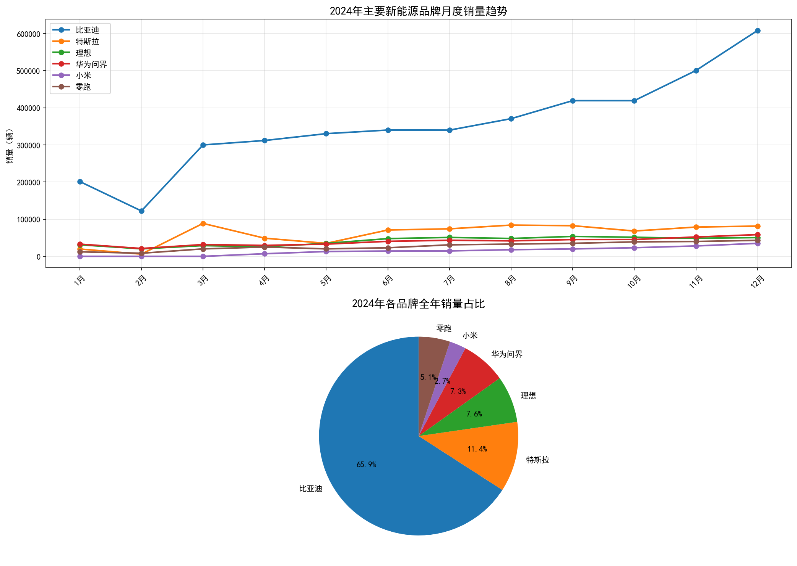
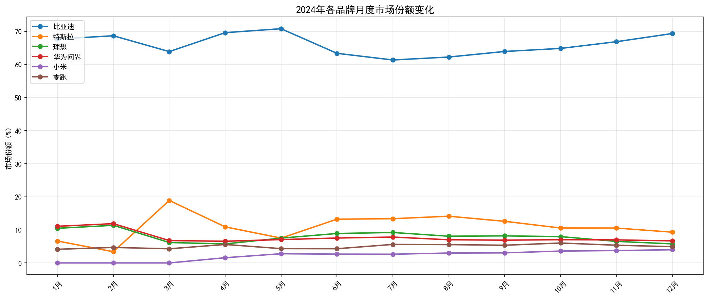

# NEV-market-analysis
2024年新能源乘用车市场竞争格局分析 | Python数据分析项目

## 项目背景
基于乘联会公开月度销量数据，对2024年主要新能源品牌（比亚迪、特斯拉、理想、华为问界、小米、零跑）进行市场竞争格局分析。

## 核心结论
2024年新能源市场呈"一超多强"格局固化态势，比亚迪份额稳定在65%以上；头部新势力增长严重分化，小米、零跑强势崛起，理想、问界份额明显承压。

## 关键发现
- **比亚迪**：份额全年维持61%-71%，护城河持续加深，新势力增长未能实质侵蚀其地位
- **特斯拉**：季末冲量策略导致份额波动剧烈（3月峰值19% vs 其他月份10%），是结构性问题
- **小米**：4月交付，12月已达4%份额、单月3.5万辆，8个月达到竞争对手数年规模
- **理想/问界**：全年份额分别下滑4.7pct和4.4pct，下半年增速垫底，是最大失血者
- **零跑**：下半年月均环比增速11.4%，稳定承接中低价格带需求

## 分析维度
- 月度销量趋势
- 动态市场份额
- 下半年环比增速
- 全年份额变化（1月 vs 12月）

## 工具
Python / Pandas / Matplotlib

## 图表

